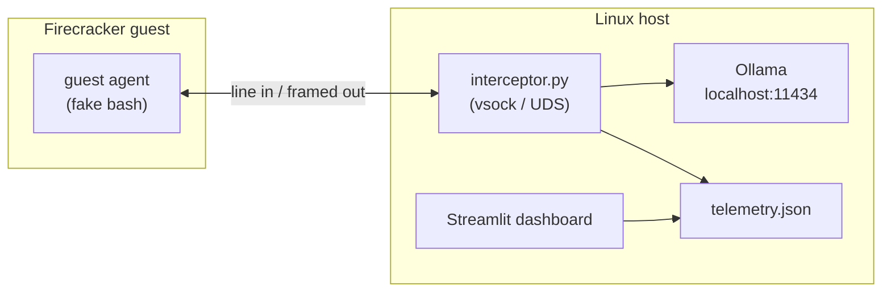

# The Petridish — Enterprise Dynamic Honeypot

A **Firecracker microVM–based honeypot** where a minimal guest presents a fake shell. Each attacker command is forwarded to the **Linux host** over **virtio-vsock**, synthesized into plausible terminal output by a **local LLM** ([Ollama](https://ollama.com/)), and streamed back to the guest. **No cloud LLMs** and **no guest network** (no virtio-net): the VM is intentionally isolated except for the vsock channel to your host.

All application code and automation live under **`honeypot-project/`**.

---

## What this project does

| Layer | Role |
|--------|------|
| **Guest** (`guest-agent/`) | Static C++ binary runs as PID 1’s child under BusyBox init. Prints `root@ubuntu:~#`, reads one line per “command”, sends it to the host over **AF_VSOCK** (port **1234**, host CID). |
| **Host** (`host-interceptor/`) | Python service listens for vsock (native **AF_VSOCK** on Linux, or **Firecracker UDS** when `HONEYPOT_VSOCK_UDS` is set). For each line, calls Ollama’s HTTP API and returns framed UTF-8 text. Appends **JSON Lines** telemetry. |
| **Infra** (`infra/`) | Downloads Firecracker + pinned **vmlinux 5.10**, builds a tiny **ext4 rootfs**, boots the VM via Firecracker’s HTTP API with vsock enabled. |
| **Analytics** (`analytics/`) | **Streamlit** dashboard reads `logs/telemetry.json` for a live operator view. |



---

## Repository layout

```
honeypot-project/
├── analytics/
│   └── dashboard.py          # Streamlit live telemetry UI
├── guest-agent/
│   ├── agent.cpp             # vsock client + fake prompt loop
│   └── Makefile              # static g++ build
├── host-interceptor/
│   ├── interceptor.py        # vsock server + Ollama + JSONL logging
│   └── requirements.txt      # requests, streamlit, pandas
├── infra/
│   ├── 01_setup_firecracker.sh   # Firecracker binary + vmlinux
│   ├── 02_build_rootfs.sh        # ext4 image (needs root)
│   ├── 03_run_vm.sh              # API boot, vsock UDS base
│   └── run/                      # API socket, logs, PID (created at runtime)
├── logs/                     # created when interceptor runs; telemetry.json here
└── test_run.sh               # demo: dashboard + interceptor + VM
```

---

## Prerequisites

- **OS**: Debian/Ubuntu Linux or **WSL2** (Ubuntu) with a normal Linux tool stack.
- **CPU**: **x86_64** or **aarch64**.
- **Virtualization**: **`/dev/kvm`** readable/writable by your user (often: `sudo usermod -aG kvm "$USER"` then re-login or `newgrp kvm`). On WSL2, nested virtualization may need to be enabled in Windows if `/dev/kvm` is missing.
- **Root (once)**: `02_build_rootfs.sh` uses loop mounts and `mkfs.ext4` — run with `sudo`.
- **Build tools**: `g++`, `make`, `curl`, standard utilities (see script checks in `02_build_rootfs.sh`).
- **Python**: `python3` plus packages from `host-interceptor/requirements.txt`.
- **Ollama**: Running locally so `http://localhost:11434/api/chat` works **from the same environment** that runs `interceptor.py` (e.g. `ollama serve`). Default model in code: **`llama3.2`** — pull it first (`ollama pull llama3.2`) or change `OLLAMA_MODEL` in `interceptor.py`.

---

## Quick start (full demo)

From **`honeypot-project/`**:

1. **One-time setup**

   ```bash
   ./infra/01_setup_firecracker.sh
   sudo ./infra/02_build_rootfs.sh
   ```

2. **Python dependencies**

   ```bash
   pip install -r host-interceptor/requirements.txt
   ```

3. **Start Ollama** (separate terminal or Windows host, depending on your layout) so `localhost:11434` is reachable from WSL/Linux where you run the interceptor.

4. **Run the orchestrated demo**

   ```bash
   ./test_run.sh
   ```

   This script:

   - Starts **Streamlit** in the background (default UI: **http://localhost:8501**).
   - Starts **`interceptor.py`** with `HONEYPOT_VSOCK_UDS=/tmp/honeypot-fc-vsock`.
   - Runs **`infra/03_run_vm.sh`** to boot Firecracker.
   - Waits on the interceptor; **Ctrl+C** tears down Streamlit, interceptor, and Firecracker (via `infra/run/firecracker.pid`).

---

## Manual operation (step by step)

Use this when you prefer not to use `test_run.sh`, or to debug individual pieces.

### 1. Boot Firecracker

After `01` and `02` have succeeded:

```bash
cd honeypot-project
./infra/03_run_vm.sh
```

Optional: match vsock UDS base everywhere (default is `/tmp/honeypot-fc-vsock`):

```bash
export HONEYPOT_VSOCK_UDS=/tmp/honeypot-fc-vsock
./infra/03_run_vm.sh
```

Firecracker maps guest→host vsock connections on port **P** to host Unix socket **`${uds_path}_P`**. With port **1234**, the host listens on **`${uds_path}_1234`**.

### 2. Start the host interceptor

**Firecracker mode** (matches `03_run_vm.sh`):

```bash
export HONEYPOT_VSOCK_UDS=/tmp/honeypot-fc-vsock   # same base as Firecracker uds_path, no _1234 suffix
python3 host-interceptor/interceptor.py
```

**Native AF_VSOCK** (non–Firecracker Linux guest with vsock to host): omit `HONEYPOT_VSOCK_UDS`; the interceptor binds **AF_VSOCK** on port **1234** (requires Python built with vsock support on Linux).

### 3. View telemetry

```bash
streamlit run analytics/dashboard.py
```

Reads **`honeypot-project/logs/telemetry.json`** (JSONL: one JSON object per line). The interceptor creates `logs/` if needed.

---

## Wire protocol (guest ↔ host)

Must stay aligned between **`guest-agent/agent.cpp`** and **`host-interceptor/interceptor.py`**.

| Direction | Format |
|-----------|--------|
| **Guest → host** | One UTF-8 command line terminated by **`\n`** per message. |
| **Host → guest** | **4-byte big-endian uint32** length + UTF-8 payload (multi-line safe). |

---

## Telemetry schema

Each intercepted command appends one line to **`logs/telemetry.json`**:

| Field | Meaning |
|--------|---------|
| `timestamp` | ISO-8601 UTC when the command was processed |
| `attacker_command` | Raw line from the guest (treat as untrusted) |
| `llm_response` | Text returned to the guest |

The dashboard is **read-only**; only the interceptor writes this file.

---

## Configuration knobs

| Item | Location / notes |
|------|-------------------|
| Vsock port **1234** | Hardcoded in `agent.cpp` (`kVsockPort`) and `interceptor.py` (`VSOCK_PORT`) — change in both if you need another port. |
| Ollama URL / model | `interceptor.py`: `OLLAMA_URL`, `OLLAMA_MODEL` (default `llama3.2`). |
| Firecracker vsock UDS | `HONEYPOT_VSOCK_UDS` env var; must match `uds_path` in `03_run_vm.sh` (without `_PORT` suffix). |
| Machine / memory | `03_run_vm.sh`: `machine-config` (1 vCPU, 128 MiB in the script). |

---

## Troubleshooting

| Symptom | What to check |
|---------|----------------|
| `not a git repository` | Run `git init` in the repo root if you have not initialized Git yet. |
| `/dev/kvm` missing or permission denied | BIOS virtualization, KVM modules, `kvm` group, WSL2 nested virt (see `01_setup_firecracker.sh` messages). |
| Guest cannot connect / host idle | Interceptor must be running **before** or soon after guest boot; Firecracker UDS path must equal `HONEYPOT_VSOCK_UDS` + `_${port}`. |
| `[honeypot-host] Could not reach local Ollama` | `ollama serve`, firewall, and whether WSL can reach Windows `localhost` if Ollama runs on Windows. |
| Streamlit “No telemetry” | Generate commands in the guest; confirm `logs/telemetry.json` is being appended. |
| `setsid not found` | Rare; install `util-linux` or run dashboard/interceptor/VM manually without `test_run.sh`. |

---

## Security and ethics

- This is a **research / lab honeypot** pattern: isolated microVM, local inference, structured logging.
- The system prompt asks the model for **plausible fictional** output and to avoid real third-party exploit code; **you** are responsible for deployment law, consent, data handling, and not exposing host services beyond what you intend.
- Do not expose the interceptor or Ollama to untrusted networks without hardening.

---

## License

Add a `LICENSE` file if you intend open-source distribution; this README does not specify one.

---

## Contributing

Typical flow: fork → branch → PR. Keep guest and host wire formats in sync when changing protocol or ports.
