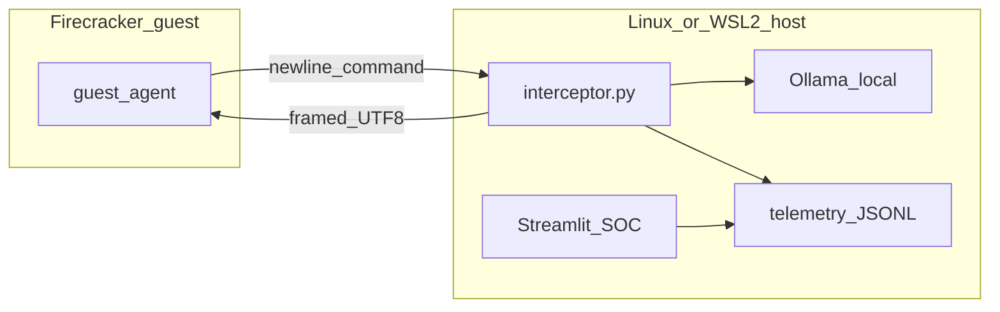

# Architecture — The Petridish

## System overview

## Trust boundary

- The **guest microVM** has **no virtio-net** in the default stack: attackers inside the guest do not get Internet egress through an emulated NIC.
- The **only intentional guest egress path** in this design is **vsock** to the host interceptor, which then calls **local Ollama** and writes **telemetry** on the host filesystem.

## Wire protocol (guest ↔ host)

| Direction | Format |
|-----------|--------|
| Guest → host | One UTF-8 line per command, terminated by `\n`. |
| Host → guest | 4-byte big-endian `uint32` length + UTF-8 payload (multi-line safe). |

Implementations must stay aligned:

- [honeypot-project/guest-agent/agent.cpp](../honeypot-project/guest-agent/agent.cpp)
- [honeypot-project/host-interceptor/interceptor.py](../honeypot-project/host-interceptor/interceptor.py)

## Telemetry

Each command produces one JSON object (JSONL) with at least:

- `timestamp`, `session_id`, `command_index`, `latency_ms`, `status`, `error_type`, `attacker_command`, `llm_response`

The Streamlit dashboard is **read-only** toward telemetry; the interceptor is the writer.

## Key scripts

| Path | Role |
|------|------|
| `honeypot-project/infra/01_setup_firecracker.sh` | Fetch Firecracker + vmlinux |
| `honeypot-project/infra/02_build_rootfs.sh` | Build ext4 rootfs (requires root) |
| `honeypot-project/infra/03_run_vm.sh` | Boot VM via Firecracker API |
| `honeypot-project/test_run.sh` | One-shot demo: dashboard + interceptor + VM |
| `scripts/demo/preflight.sh` | Environment checks before `test_run.sh` |
